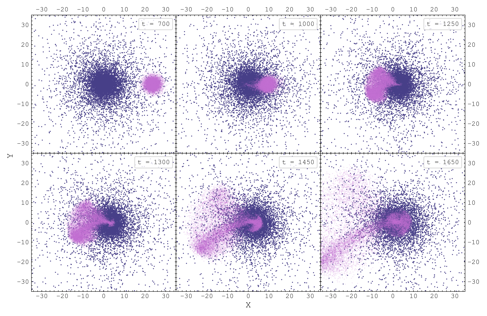
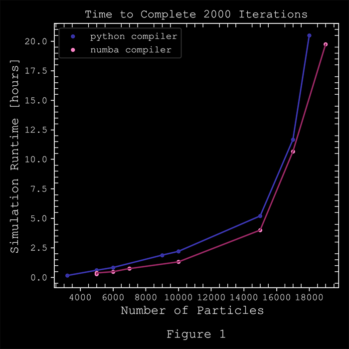

# MSG-Nbody



<div align="justify"> 

This package offers an efficient fully vectorized numpy implementation of the particle-particle N-body simulation algorithm which integrates the motion of stellar particles through space under their mutual gravitational attraction. Initial conditions of different galaxy models in equilibrium are provided, including a Hernquist spherical galaxy and a simple disk galaxy. The algorithm for generating spherical galaxy initial conditions of different masses and scale lengths is also provided for further customizations. Yet, any set of initial conditions can be used as inputs to the simulation code, which will integrate their motions and output snapshot files saved directly to a specified directory. On a reasonably powerful personal computer, the code can support up to ~20,000 - 30,000 particles with runtimes on the order of a couple of days. Lowering the number of particles and switching to the Numba compiler will yield drastically faster runtimes. The time to complete 2000 timesteps as a function of number of particles is plotted in Figure 1, with the nopython Numba compiler offering a substantial decrease in computation time over the standard Python compiler. Therefore the purpose of this package is to provide an accessible package that is simple to set up and modify yet still simulates the effects of gravity with reasonable accuracy for users not conducting serious astrophysical research.

## The N-Body Problem

<figure>
  
</figure>

The N-body problem in astrophysics attempts to solve the motion of $N$ bodies through space under their mutual gravitational attraction. For a system with $N = 2$ bodies, there exists an analytical solution to their trajectories, allowing for accurate predictions of their positions and velocities at some future time $t$. The problem arises when $N \geq$ 3, where the chaotic nature of the system results in no solvable analytic solution. Chaotic systems are not random in nature but instead are characterized by having a unique solution to every set of initial conditions. These systems are highly sensitive to changes in initial conditions, where seemingly small fluctuations can lead to highly divergent solutions. For small numbers of $N$, constraints can be made to approximate the trajectories accurately. Yet when studying globular clusters or galaxies, $N \simeq 10^6-10^{11}$, therefore complicating calculations a great deal. Thus, the lack of an analytical solution requires a numerical approach for predicting the orbits of systems with large $N$. Numerical approximations integrate the equations of motion of each particle in discrete timesteps $\Delta t$, and then recursively use the previous set of positions and velocities to compute the next timestep. 

In this simulation, all particles are assumed to be collisionless, baryonic, stellar masses which are affected solely by gravitational forces. Collisions can be ignored completely when simulating stellar particles only due to the relaxation time of the system, which is defined as how long it takes for some star's trajectory to be significantly perturbed by the other stars in the system (equation 1). For a typical galaxy containing $N = 10^{11}$ stars and a crossing time of ~ $10^8$ years (average time for a star to cross the galaxy; $t_{cross} = \frac{R}{v}$), the relaxation time is orders of magnitude larger than a typical simulation timescale of a couple Gigayears. Thus, collisions can safely be removed as long as gas is not included in the simulation, which is collisional. The N-body code therefore assumes the only force operating on the particles is from their mutual gravitational attraction. Given a set of particles with initial positions and velocities, the next timestep is computed by brute force using the leap-frog algorithm. For each particle, the gravitational acceleration acting onto it must be calculated by summing up the individual particle-particle contributions from all the other stars. Thus, the gravitational acceleration $g_i$ onto a particle $p_{i}$ can be expressed as a sum over all the other particles $j$, where $r$ represents the particle's positional vector in 3D space and $\epsilon$, the softening length (equation 2). $\epsilon$ ensures the effects of close encounters are smoothed, and that dividing by zero does not occur. Its value is determined by the number of particles based on a relation derived by Dehnen (2001) for Plummer spheres (equation 3), and also serves as the simulation resolution. Close encounters between particles with a distance smaller than $\epsilon$ cannot be resolved.
<br>
$$t_{relax}\simeq\frac{N}{8lnN}\frac{R}{v}  \qquad (1) \qquad g_{i} = G\sum_{j}^{N}\frac{m_{j}[r_{j}-r_{i}]}{[|r_{j}-r_{i}|^2 + \epsilon ^2]^{3/2}} \qquad (2) \qquad \epsilon = 0.017 \left[ \frac{N}{10^5} \right]^{-0.23} \qquad (3)$$

Because this algorithm calculates the gravitational force from each particle onto each particle resulting in O($N^2$) calculations, the number of particles must be kept down. Thus the dark matter halo, central bulge and black hole, as well as gas particles, which are important components of galaxies are completely omitted in these simulations.

## N-Body Particle-Particle Algorithm
Once the gravitational acceleration onto each particle is computed for a given timestep using equation 2, the positions and velocities of the next timestep can then be calculated using the standard kinematic equations of motion (equations 4 and 5). The leap-frog algorithm computes the velocities and positions at interleaved timesteps where the velocities are calculated at half timesteps before and after computing the new positions. This creates a ’kick,’ ’drift,’ ’kick’ method conserving Energy to the second order and is a good trade-off between accuracy and computational efficiency. The new positions are then used to calculate a new set of accelerations, continuing the cycle endlessly.
$$v_{t+\frac{1}{2}} = v_{t} + g_{t} \frac{\Delta t}{2} \qquad (4) \qquad \qquad x_{t+1} = x_{t} + v_{t+\frac{1}{2}} \Delta t \qquad (5)$$
The integrator saves the phase space coordinates $x,y,z,v_{x},v_{y},v_{z}$, and potential $\phi_{i} = \frac{1}{m_{i}}\sum_{j} \frac{Gm_{j}}{|r_{j}-r_{i} + \epsilon|}$ of each particle every 10 timesteps as a $Nx7$ matrix. Moreover, in all simulations runs model units are assumed, where the gravitational constant $G$, the total system mass $M$, and scale length $\alpha$ are all set equal to 1. The models can then easily be scaled relative to each other by multiplying the initial phase space coordinates and masses by scalar quantities. Furthermore, in these models, each particle represents a large collection of stars since these simulations support $N \propto 10^4$ particles, or many orders of magnitude less than real galaxies. Thus, the greater the number of particles, the higher the simulation resolution. Certain features seen in merger remnants such as stellar shells require large numbers of particles to resolve. As such, simulating millions of particles requires both heavy computational power from super-clusters and more efficient N-body integration schemes.

## Requirements
Numpy for numerical computation
```
$ conda install numpy
```
SciPy for numerical integration
```
$ conda install scipy
```
Matplotlib for data visualization 
```
$ conda install matplotlib
```
tqdm for progress bar
```
$ conda install -c conda-forge tqdm
```
OPTIONAL BUT HIGHLY RECOMMENDED: 
\
Numba for faster simulation runtimes
```
$ conda install numba
```

## Acknowledgments
I would like to thank Professor Jeffrey Kenney and Shashank Dattathri for providing invaluable help in completing this project.
This would not have been possible without them. I would also like to thank my Astro Big-Sib Sebastian Monzon and Barry Chiang for helping me out with running the simulations. 
</div>
